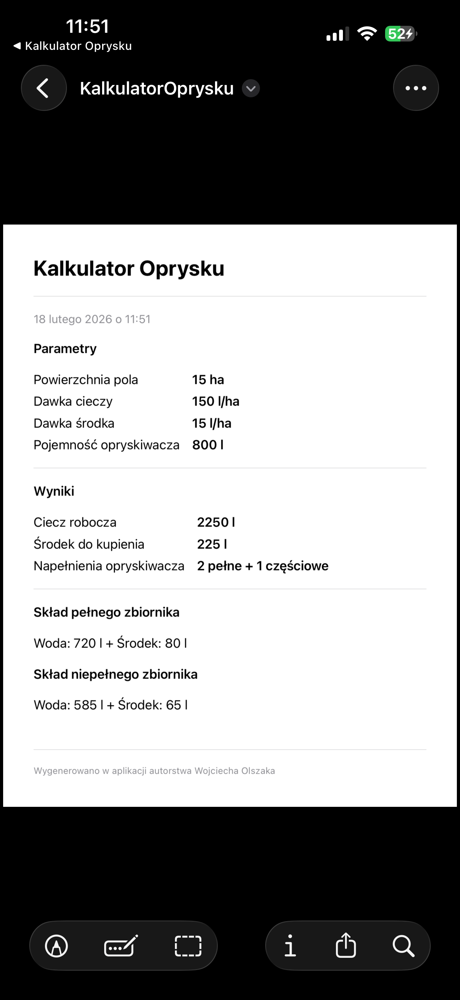
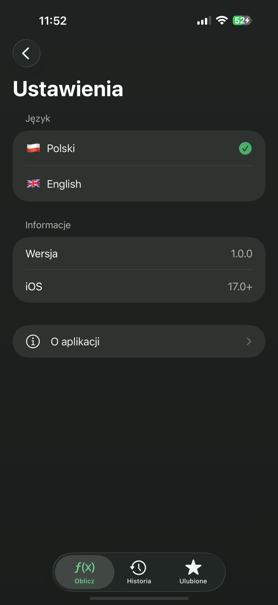

# spray-calc-ios


Professional iOS agricultural spray calculator designed for farmers and agronomists. Enter your field area, sprayer tank capacity, spray dose, and chemical concentration — the app calculates total working fluid volume, chemical quantity, and divides everything across full and partial tank loads.

## Screenshots

### Calculator & Results

<p align="center">
  &nbsp;&nbsp;
  &nbsp;&nbsp;
  &nbsp;&nbsp;
  
</p>

<p align="center">
  <sub>Input form · Tractor animation · Detailed results · PDF export</sub>
</p>

### History, Favorites & Settings

<p align="center">
  &nbsp;&nbsp;
  &nbsp;&nbsp;
  &nbsp;&nbsp;
  
</p>

<p align="center">
  <sub>History (collapsed) · History (expanded) · Saved favorites · Settings with language picker</sub>
</p>

---

## Features

- **Spray Calculation Engine** — computes total working fluid, chemical amount, and tank load distribution (full + partial)
- **PDF Export** — generate professional calculation reports via `ShareLink` and share them instantly
- **Calculation History** — browse and revisit previous calculations at any time
- **Favorites** — save frequently used configurations for quick access
- **Bilingual UI** — full Polish and English localization
- **Dark Mode** — native support for light and dark appearance
- **Dynamic Type** — accessible text scaling across the entire interface
- **Tractor Animation** — polished animated element enhancing the user experience

## Tech Stack

| Layer | Technology |
|---|---|
| Language | Swift |
| UI Framework | SwiftUI |
| Minimum Target | iOS 17 |
| Architecture | MVVM with `@Observable` |
| PDF Generation | PDFKit / CGContext |
| Reactivity | `@Observable` macro (Observation framework) |

## Getting Started

### Requirements

- Xcode 15.0 or later
- iOS 17.0+ deployment target
- macOS Ventura or later (for building)

### Installation

```bash
git clone https://github.com/selter2001/spray-calc-ios.git
cd spray-calc-ios
open SprayCalculator.xcodeproj
```

Select your target device or simulator and press **Cmd + R** to build and run.

## Architecture

The project follows the **MVVM** pattern powered by the iOS 17 `@Observable` macro:

```
├── App
│   └── SprayCalculatorApp.swift
├── ViewModels
│   └── CalcViewModel.swift
├── Services
│   ├── SprayCalculatorService.swift
│   └── PDFExportService.swift
└── Views
    ├── ContentView.swift
    ├── HistoryView.swift
    ├── FavoritesView.swift
    ├── SettingsView.swift
    └── AboutView.swift
```

- **CalcViewModel** — holds calculation state, input validation, and drives the UI via `@Observable`
- **SprayCalculatorService** — core calculation logic decoupled from the view layer
- **PDFExportService** — generates shareable PDF reports using CGContext

## Author

**Wojciech Olszak** — [@selter2001](https://github.com/selter2001)

## License

This project is licensed under the MIT License. See the [LICENSE](LICENSE) file for details.

---

# spray-calc-ios

Profesjonalny kalkulator oprysku dla systemu iOS, zaprojektowany z myslą o rolnikach i agronomach. Wprowadź powierzchnię pola, pojemność zbiornika opryskiwacza, dawkę cieczy roboczej oraz stężenie środka chemicznego — aplikacja obliczy całkowitą objętość cieczy roboczej, ilość środka chemicznego i rozdzieli wszystko na pełne oraz niepełne zbiorniki.

## Zrzuty ekranu

### Kalkulator i wyniki

<p align="center">
  &nbsp;&nbsp;
  &nbsp;&nbsp;
  &nbsp;&nbsp;
  
</p>

<p align="center">
  <sub>Formularz · Animacja traktora · Szczegółowe wyniki · Eksport PDF</sub>
</p>

### Historia, ulubione i ustawienia

<p align="center">
  &nbsp;&nbsp;
  &nbsp;&nbsp;
  &nbsp;&nbsp;
  
</p>

<p align="center">
  <sub>Historia (zwinięta) · Historia (rozwinięta) · Zapisane ulubione · Ustawienia z wyborem języka</sub>
</p>

---

## Funkcje

- **Silnik obliczeń** — wylicza całkowitą objętość cieczy roboczej, ilość środka i podział na zbiorniki (pełne + niepełne)
- **Eksport PDF** — generowanie profesjonalnych raportów z obliczeń przez `ShareLink` z możliwością natychmiastowego udostępnienia
- **Historia obliczeń** — przeglądanie i powrót do wcześniejszych kalkulacji
- **Ulubione** — zapisywanie często używanych konfiguracji dla szybkiego dostępu
- **Dwujęzyczny interfejs** — pełna lokalizacja polska i angielska
- **Tryb ciemny** — natywne wsparcie dla jasnego i ciemnego motywu
- **Dynamic Type** — dostępne skalowanie tekstu w całym interfejsie
- **Animacja traktora** — dopracowany element animowany wzbogacający doświadczenie użytkownika

## Stos technologiczny

| Warstwa | Technologia |
|---|---|
| Język | Swift |
| Framework UI | SwiftUI |
| Minimalny target | iOS 17 |
| Architektura | MVVM z `@Observable` |
| Generowanie PDF | PDFKit / CGContext |
| Reaktywność | Makro `@Observable` (Observation framework) |

## Jak zacząć

### Wymagania

- Xcode 15.0 lub nowszy
- Target wdrożeniowy iOS 17.0+
- macOS Ventura lub nowszy (do kompilacji)

### Instalacja

```bash
git clone https://github.com/selter2001/spray-calc-ios.git
cd spray-calc-ios
open SprayCalculator.xcodeproj
```

Wybierz urządzenie docelowe lub symulator i naciśnij **Cmd + R**, aby zbudować i uruchomić projekt.

## Architektura

Projekt stosuje wzorzec **MVVM** oparty na makrze `@Observable` z iOS 17:

```
├── App
│   └── SprayCalculatorApp.swift
├── ViewModels
│   └── CalcViewModel.swift
├── Services
│   ├── SprayCalculatorService.swift
│   └── PDFExportService.swift
└── Views
    ├── ContentView.swift
    ├── HistoryView.swift
    ├── FavoritesView.swift
    ├── SettingsView.swift
    └── AboutView.swift
```

- **CalcViewModel** — przechowuje stan obliczeń, walidację danych wejściowych i zasila UI przez `@Observable`
- **SprayCalculatorService** — logika obliczeń odseparowana od warstwy widoku
- **PDFExportService** — generuje udostępnialne raporty PDF za pomocą CGContext

## Autor

**Wojciech Olszak** — [@selter2001](https://github.com/selter2001)

## Licencja

Projekt jest objęty licencją MIT. Szczegóły w pliku [LICENSE](LICENSE).
